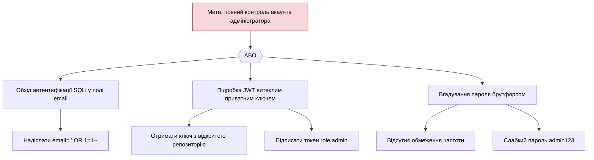

```mermaid
%%{init: {'flowchart': {'wrappingWidth': 260}}}%%
flowchart TB
    G[Мета: повний контроль акаунта адміністратора]:::root
    O1{{АБО}}
    G --> O1
    O1 --> A1[Обхід автентифікації SQLi у полі email]
    O1 --> A2[Підробка JWT витеклим приватним ключем]
    O1 --> A3[Вгадування пароля брутфорсом]
    A1 --> A1a[Надіслати email= ' OR 1=1--]
    A2 --> A2a[Отримати ключ з відкритого репозиторію]
    A2 --> A2b[Підписати токен role admin]
    A3 --> A3a[Відсутнє обмеження частоти]
    A3 --> A3b[Слабкий пароль admin123]
    classDef root fill:#f8d7da,stroke:#842029,color:#000;
```
