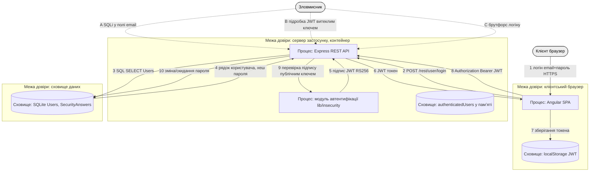

```mermaid
%%{init: {'flowchart': {'wrappingWidth': 320}}}%%
flowchart TB
    attacker([Зловмисник]):::ext
    user([Клієнт браузер]):::ext
    subgraph TBc["Межа довіри: клієнтський браузер"]
      spa["Процес: Angular SPA"]
      ls[("Сховище: localStorage JWT")]
    end
    subgraph TBs["Межа довіри: сервер застосунку, контейнер"]
      api["Процес: Express REST API"]
      authm["Процес: модуль автентифікації lib/insecurity"]
      amap[("Сховище: authenticatedUsers у памʼяті")]
    end
    subgraph TBd["Межа довіри: сховище даних"]
      db[("Сховище: SQLite Users, SecurityAnswers")]
    end
    user -->|"1 логін email+пароль HTTPS"| spa
    spa -->|"2 POST /rest/user/login"| api
    api -->|"3 SQL SELECT Users"| db
    db -->|"4 рядок користувача, хеш пароля"| api
    authm -->|"5 підпис JWT RS256"| api
    api -->|"6 JWT токен"| spa
    spa -->|"7 зберігання токена"| ls
    spa -->|"8 Authorization Bearer JWT"| api
    api -->|"9 перевірка підпису публічним ключем"| authm
    api -->|"10 зміна/скидання пароля"| db
    attacker -.->|"A SQLi у полі email"| api
    attacker -.->|"B підробка JWT витеклим ключем"| api
    attacker -.->|"C брутфорс логіну"| api
    classDef ext fill:#eee,stroke:#333,color:#000;
```
